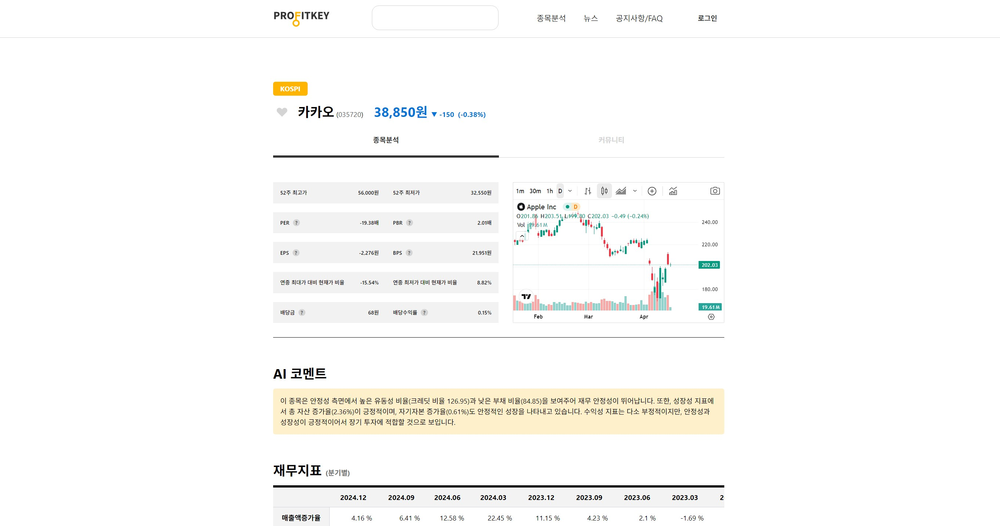
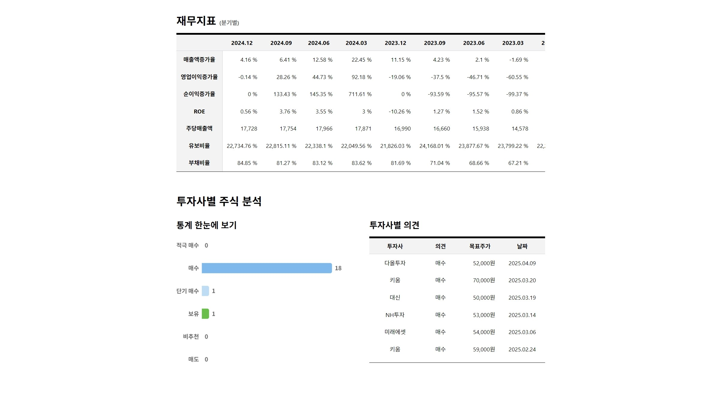
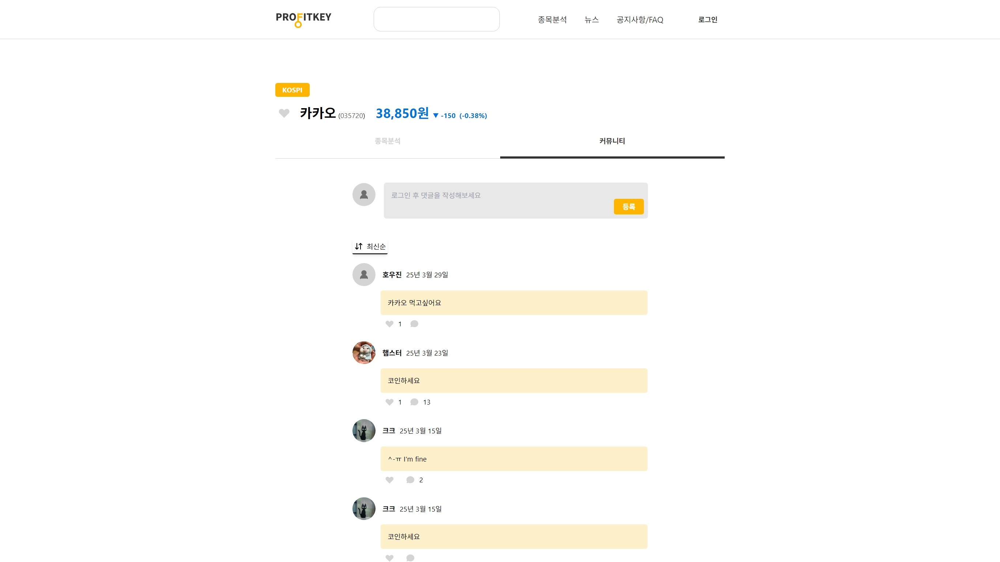
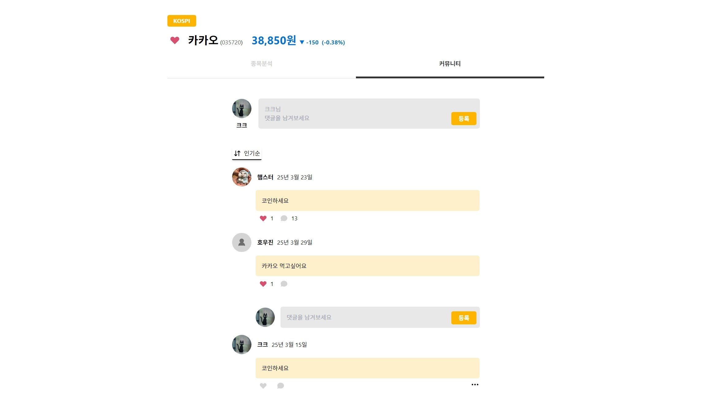
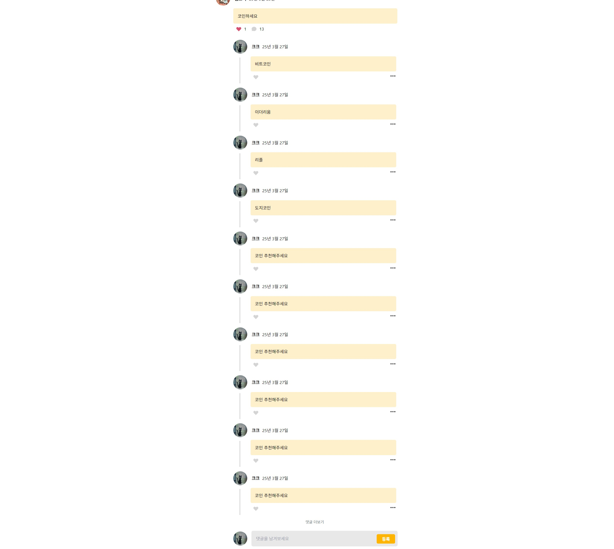
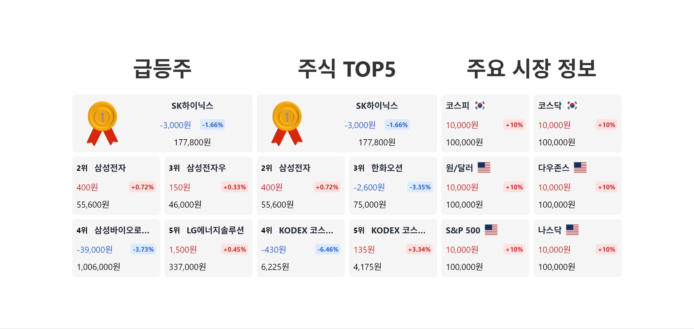

### 📌 주식 투자 정보 플랫폼

- **소속:** 개인 프로젝트
- **기간:** 2024. 1. 15 ~ 2024. 2. 29
- **담당 역할:** 프론트엔드 개발

---

### **📌 프로젝트 개요**

**목표**

- AI 추천 기반 국내 주식 투자 정보 제공
- 주식 정보 데이터의 직관적 시각화 및 커뮤니티 기능 구현

**문제점 및 해결 방법**

- **데이터 로딩 상태 관리** → React Query의 Suspense 옵션 활용
- **댓글 무한 스크롤 구현 문제** → TanStack Query의 infinite query 로직 개선
- **데이터 검증 오류** → TypeScript와 Zod를 활용한 타입 검증 강화
- **SPA 딥링킹 문제** → Vercel 설정으로 해결

---

### **📌 주요 업무 및 역할**

### ✅ **주가 정보 표시 기능 구현**


- 현재가, 전일 대비 등락률 등 기본 정보 표시
- Chart.js를 활용한 주요 지표 시각화
- 실시간 데이터 업데이트 구현

### ✅ **기업 재무정보 분석 기능 개발**


- 분기별/연간 재무제표 데이터 표시
- PER, PBR, ROE 등 주요 재무비율 시각화
- 투자 의견 테이블 및 차트 구현

### ✅ **커뮤니티 기능 구현**




- 댓글/대댓글 CRUD 기능 개발
- 좋아요 기능 구현
- 무한 스크롤 적용

### ✅ **주식 랭킹 보드 구현**


- 실시간 주식 랭킹 표시
- 정렬 및 필터링 기능 구현

---

### **📌 성과 및 기여**

**💡 기술적 성과**

- React Query를 활용한 효율적인 데이터 캐싱 구현
- TypeScript와 Zod를 통한 타입 안정성 확보
- Chart.js를 활용한 직관적인 데이터 시각화

**💡 사용자 경험 개선**

- Suspense를 통한 로딩 상태 관리 개선
- 무한 스크롤을 통한 댓글 목록 최적화
- 반응형 디자인 구현으로 다양한 디바이스 지원

---

### **📌 사용 기술 및 도구**

- **프론트엔드:** React (Vite), TypeScript
- **상태 관리:** TanStack Query, Axios
- **스타일링:** Tailwind CSS
- **데이터 시각화:** Chart.js
- **배포:** Vercel

---

### **📌 트러블 슈팅**

#### 🚨 **주식 정보 데이터 불러오기**

- **문제:** 데이터 로딩 상태 관리가 불편하고 사용자 경험이 좋지 않음
- **해결:** React Query의 suspense 옵션 활용
  - 컴포넌트가 데이터가 준비될 때까지 자동으로 대기하도록 구현
  - 로딩 상태를 효과적으로 관리하여 사용자 경험 개선

#### 🚨 **댓글 무한 스크롤 구현**

- **문제:** TanStack Query의 infinite query 사용 시 첫 페이지만 반복해서 불러오는 문제 발생
- **해결:** 
  - page 파라미터 갱신 로직 개선
  - fetchNextPage 함수의 파라미터와 getNextPageParam 설정 수정
  - 정상적인 페이지네이션 구현으로 해결

#### 🚨 **데이터 검증 오류**

- **문제:** content가 null인 잘못된 데이터로 인한 zod validation 에러 발생
- **해결:**
  - TypeScript와 Zod를 활용한 타입 검증 강화
  - API 응답 데이터에 대한 엄격한 검증 로직 구현
  - 잘못된 데이터는 DB에서 직접 삭제 요청

#### 🚨 **SPA 딥링킹 문제**

- **문제:** Vite로 SPA 배포 시 딥링킹(직접 URL 접근)이 동작하지 않음
- **해결:** vercel.json 파일에 rewrite 설정 추가
  ```json
  {
    "rewrites": [
      {
        "source": "/(.*)",
        "destination": "/index.html"
      }
    ]
  }
  ```

---

### **📌 링크**
- [라이브 데모](https://profitkey-inky.vercel.app/)
- [GitHub 저장소](https://github.com/nayeongdev/profitkey-front)